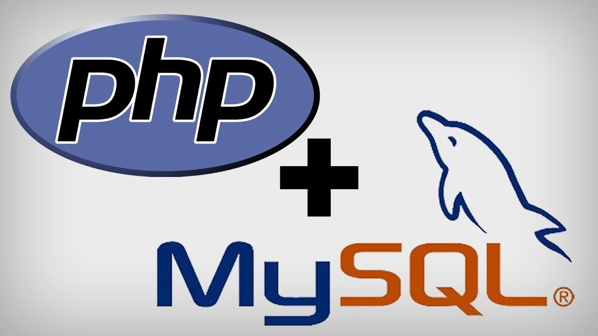

# Atelier 410-php-database

## Ceci n'est pas un atelier !

Juste des exemples d'utilisation de la bibliothèque PDO pour communiquer en PHP avec la base de données MySQL (MariaDB pour être précis).
