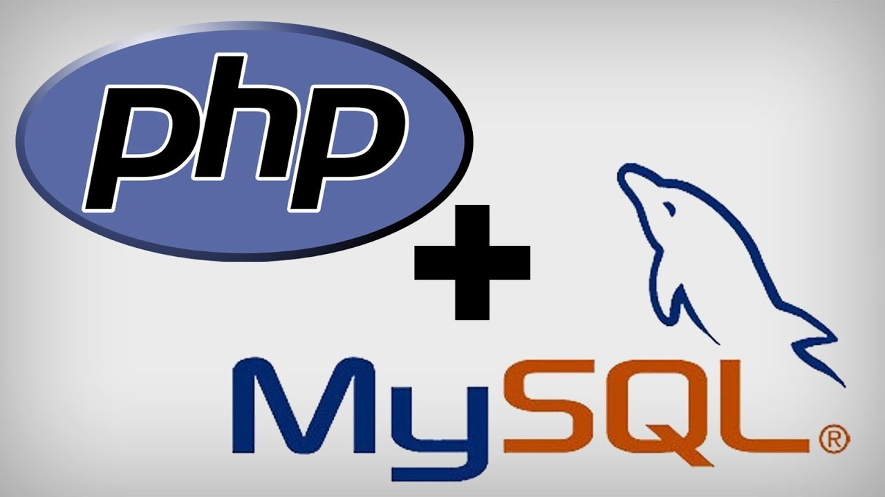

# Atelier 410-php-database

## Contexte collectif !

à partir de la base de code donnée,

qui fournit des exemples d'utilisation de la bibliothèque PDO pour communiquer en PHP avec la base de données MySQL (MariaDB pour être précis),

mais qui est **très mal** écrite (!!),

améliorer **ensemble** les façons de faire pour construire de solides bases à ré-utiliser de partout.

## Objectifs

- supprimer tout ce **code dupliqué** !
- compléter les CRUDs (il manque notamment la mise à jour et la suppression)

## Conseils pro...

C'est le bon moment pour commencer à :
- utiliser **git** en vrai !
- bien choisir le nom de ses fichiers
- bien choisir le nom de ses variables
- ré-utiliser vos skills **front** pour faire de belles pages qui pourront vous servir de **port-folio** !

